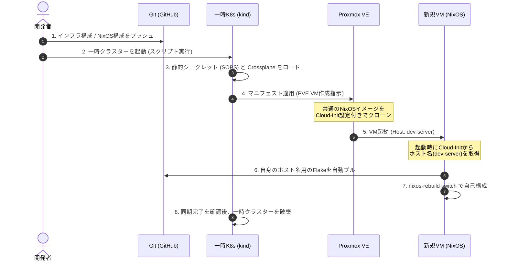

# Crossplane 移行・運用設計方針 (ガードレール)

本リポジトリにおける自宅インフラ（PVE, VM, k8s等）の管理を、従来の Terraform/OpenTofu および Ansible/Colmena（手動実行）から、**Crossplane を用いた完全宣言的かつ State-free（無状態）な GitOps 構成**へ移行するための設計思想と運用ガードレールをここに定義します。

---

## 1. 基本設計思想 (Philosophy)

### ① State-free (無状態) の徹底
* **課題**: Terraform の State 紛失によるインフラ崩壊の恐怖や、Crossplane における常時起動 etcd（K8s）の維持・バックアップコスト。
* **解決策**: 管理用の Crossplane クラスターは **一時マシン（ローカルの kind/k3d 等）上でオンデマンドに起動・破棄される「使い捨て」クラスター** とします。
* **ガードレール**: State（etcd）がいつでも吹き飛んで良い設計にします。状態の同期は、Git にコミットされたマニフェストのみを正（Single Source of Truth）として行います。

### ② No Manual Intervention (完全自動ブートストラップ)
* **課題**: VM作成後に手動で `colmena apply` や `nixos-anywhere` を実行しなければならない運用の煩雑さ。
* **解決策**: **「VMの起動 ＝ NixOS構成の完全同期」** を実現します。
* **ガードレール**: Crossplane による VM プロビジョニングと、NixOS 自体の自律的な Git 追跡（`system.autoUpgrade`）を組み合わせ、人間の手動介入を一切排除します。

---

## 2. アーキテクチャと連携の流れ

---

## 3. 開発・運用ガードレール (遵守事項)

今後インフラを定義・更新する際は、以下のガードレールを厳格に遵守してください。

### 【ルール1】`external-name` の静的定義
* **内容**: 全てのマニフェストにおいて、`metadata.annotations["crossplane.io/external-name"]` を最初から明示（ハードコード）します。
* **理由**: 一時クラスターが再起動した際、新規作成ではなく「既存リソースへのアタッチ（Adopt）」を確実に行わせるためです。
* **例 (VM定義)**: PVE の VM ID を静的に決めてマニフェストに記載します。

### 【ルール2】シークレット（接続情報）の静的プリロード
* **内容**: Crossplane が動的に生成する接続用シークレットには依存しません。SSH鍵やAPIトークン、パスワードなどは事前に定義し、SOPS 等で暗号化して Git 管理します。
* **理由**: etcd が破棄された際に、VM等への接続情報がロストするのを防ぐためです。

### 【ルール3】ベースイメージの共通化 (Cloud-Init 原則)
* **内容**: 作成する NixOS のテンプレートイメージ（QCOW2）は、**全VMで共通の「たった1つ」** とします。VMの「役割（ホスト名や設定）」ごとに個別のイメージをビルドしてはいけません。
* **理由**: イメージ管理コストを最小限に抑えるためです。
* **仕組み**: 
  1. 共通イメージには「Cloud-Init の有効化」と「起動時に `$(hostname)` を取得して `nixos-rebuild switch --flake .#$(hostname)` を実行する systemd サービス」のみを焼き込んでおきます。
  2. Crossplane 側から Cloud-Init を介して個別のホスト名を注入します。

---

## 4. 移行ロードマップ

Terraform からの移行は以下のフェーズで段階的に進めます。

### フェーズ 1: 共通NixOSテンプレートイメージの作成
* [ ] 共通設定（Cloud-Init + 起動時GitOpsスクリプト）を含んだ NixOS 設定の作成
* [ ] `nixos-generators` 等を用いた QCOW2 イメージのビルドと Proxmox への登録

### フェーズ 2: 一時管理クラスターの自動構築スクリプト作成
* [ ] ローカル（kind/k3d）での K8s 起動スクリプトの作成
* [ ] SOPS 等を用いた静的 Secret の復号とクラスターへの自動投入処理の実装

### フェーズ 3: Crossplane マニフェストへの置き換え (PVE VM)
* [ ] `provider-proxmoxve` を用いた VM プロビジョニング定義の作成
* [ ] Terraform から既存の PVE VM を Crossplane 管理へインポート（`external-name` を使用）

### フェーズ 4: 他プロバイダー (Cloudflare, Talos) の移行
* [ ] ドメイン管理（Cloudflare）の Crossplane への移行
* [ ] Talos K8s クラスターの Crossplane 管理への移行
