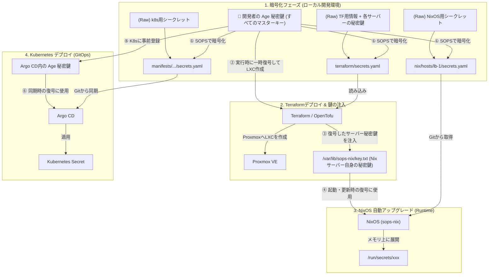

# SOPS と Age によるシークレット管理・運用方針

このドキュメントでは、本リポジトリにおける SSH キー、Terraform の接続情報、および Kubernetes のシークレット情報を、**Mozilla SOPS** と **Age** を用いて安全かつ全自動で管理・運用するための設計と手順について記述する。

---

## 1. 基本方針と全体像

すべてのシークレット（秘密情報）は SOPS を用いて暗号化され、Git リポジトリに安全にコミットされる。
復号には **Age 鍵**（およびサーバーの SSH ホストキーを Age 形式に変換したもの）を使用する。

### 管理対象のシークレット一覧
1. **Terraform (Terragrunt) 用シークレット (`terraform/secrets.yaml`)**:
   * Proxmox や Cloudflare の接続用 API クレデンシャル。
   * **各 NixOS サーバー用の Age 秘密鍵**（ここがブートストラップの鍵となる）。
2. **NixOS サーバー個別シークレット (`nix/hosts/<hostname>/secrets.yaml`)**:
   * データベースの接続パスワード、各サーバー専用の SSH キーなど。
3. **Kubernetes 用シークレット (`manifests/bootstrap/secrets/secrets.yaml`)**:
   * S3、PostgreSQL、LLM（Google AI API）等のアプリケーション用認証トークン。

---

## 2. 鍵の構造と管理区分

人間が「生のファイル」として厳密に保管・バックアップしなければならない鍵は、実質 **「開発者の Age 秘密鍵」1つだけ** である。

| 鍵の名称 | 役割 | 保管場所・管理方法 |
| :--- | :--- | :--- |
| **開発者（管理者）の Age 鍵** | すべての暗号化ファイルの編集、および Terraform 実行時の復号に使用するマスターキー。 | 開発者のローカル PC (`~/.config/sops/age/keys.txt`) にのみ置き、1Password 等でバックアップする。 |
| **各 NixOS サーバー用の Age 鍵** | サーバー起動時および `autoUpgrade` 時に `sops-nix` がシークレットを復号するための鍵。 | **秘密鍵**: 開発者の鍵で暗号化して `terraform/secrets.yaml` 内に保存。<br>**公開鍵**: `.sops.yaml` に登録。 |
| **Argo CD 用の Age 鍵** | Argo CD が K8s マニフェスト適用時にシークレットを復号するための鍵。 | **秘密鍵**: クラスター構築時に一度だけ K8s Secret に直接登録。<br>**公開鍵**: `.sops.yaml` に登録。 |

---

## 3. 各コンポーネントでの運用フロー



### ① 鍵の発行と暗号化
新しいシークレットを追加または編集する場合、`sops` コマンドを使用する。
```bash
# 暗号化された状態のままエディタで直接編集する（保存時に自動再暗号化）
sops nix/hosts/lb-1/secrets.yaml
```

### ② Terraform での復号とLXC作成
1. 開発者がローカル環境で `terragrunt apply` を実行する。
2. `terraform-provider-sops` が開発者の Age 秘密鍵を使って `terraform/secrets.yaml` を一時的にメモリ上で復号する。
3. 復号されたクレデンシャルを用いて、Proxmox VE 上に LXC コンテナを作成する。

### ③ LXCへの秘密鍵の注入（ブートストラップ）
1. Terraform は `terraform/secrets.yaml` から復号した「そのサーバー用の Age 秘密鍵」を読み込む。
2. **cloud-init (write_files)** を通じて、コンテナ内の `/var/lib/sops-nix/key.txt` に秘密鍵を自動で書き込む。

### ④ NixOS (sops-nix) での自動復号とアップグレード
1. 起動時および `system.autoUpgrade` 実行時に、`sops-nix` が自動で動作する。
2. 注入された `/var/lib/sops-nix/key.txt` を用いて、Git から取得した `nix/hosts/<hostname>/secrets.yaml` を復号する。
3. 復号された平文ファイルは `/run/secrets/` に安全に展開され、OS内の各サービスがそれを読み込む。

### ⑤ Argo CD への復号鍵の事前登録（Bootstrap）
1. Argo CD が暗号化されたマニフェストを復号できるように、Argo CD 用の Age 秘密鍵をクラスター内に Kubernetes `Secret` として事前に手動登録しておく。
   ```bash
   # Argo CD 用の Age 秘密鍵を Secret として作成
   kubectl create secret generic argocd-sops-key \
     --namespace argocd \
     --from-file=key.txt=~/.config/sops/age/argocd-keys.txt
   ```

### ⑥ Argo CD による GitOps 同期と復号
1. 開発者が暗号化された `manifests/.../secrets.yaml` を Git にコミットする。
2. Argo CD が同期（Sync）する際、**Argo CD Vault Plugin (AVP)** 等が事前登録された `argocd-sops-key` を使ってメモリ上でシークレットを復号し、クラスター上に平文の `Secret` としてデプロイする。

---

## 4. 開発者秘密鍵のローテーション手順

開発者の Age 秘密鍵が漏洩の恐れがある場合、または定期的なセキュリティポリシーに従って更新する場合は、以下の手順で鍵をローテーションする。

> [!IMPORTANT]
> ローテーション作業が完了するまでは、**古い秘密鍵** をローカルから削除しないこと（既存のファイルを一度復号する際に必要となるため）。

### 手順 1: 新しい Age 鍵ペアの生成
ローカル環境で、新しく利用する Age 鍵ペアを生成する。
```bash
# 新しい鍵ペアを一時的な名前で作成
age-keygen -o ~/.config/sops/age/keys.new.txt

# 新しい公開鍵を表示してメモする (例: age1_newxxxxxxxxxxxxx)
age-keygen -y ~/.config/sops/age/keys.new.txt
```

### 手順 2: `.sops.yaml` の公開鍵の差し替え
リポジトリのルートにある `.sops.yaml` 内の `creation_rules` に記述されている古い開発者用公開鍵を、手順1で生成した **新しい公開鍵** に書き換える。

```yaml
# 例: .sops.yaml
keys:
  # 古い公開鍵を新しい公開鍵へ書き換える
  - &admin age1_newxxxxxxxxxxxxx
```

### 手順 3: 暗号化ファイルの再暗号化（updatekeys）
SOPS の `updatekeys` コマンドを使用し、リポジトリ内のすべての暗号化ファイルを新しい鍵構成で再暗号化する。
このコマンドは、古い秘密鍵で一度ファイルを復号したのち、`.sops.yaml` に定義された新しい公開鍵を使って暗号化し直す。

```bash
# ローカルに古い秘密鍵(keys.txt)が存在する状態で実行
sops updatekeys terraform/secrets.yaml
sops updatekeys nix/hosts/lb-1/secrets.yaml
sops updatekeys manifests/bootstrap/secrets/secrets.yaml
```
変更されたファイルを Git にコミットし、プッシュする。
```bash
git add .
git commit -m "security: rotate developer sops key"
git push origin master
```

### 手順 4: ローカル秘密鍵の切り替えと古い鍵の破棄
1. ローカルの古い秘密鍵を削除し、新しい秘密鍵に切り替える。
   ```bash
   # 古い鍵を削除（または別の安全な場所に一時退避）
   rm ~/.config/sops/age/keys.txt
   # 新しい鍵を本番のパスにリネーム
   mv ~/.config/sops/age/keys.new.txt ~/.config/sops/age/keys.txt
   ```
2. 実際に `sops terraform/secrets.yaml` などを実行し、新しい鍵で正常に復号・閲覧できることを確認する。
3. 過去の古い Git コミット履歴を復号する必要がないことを確認した上で、古い秘密鍵（退避したもの）を安全に完全破棄する。
